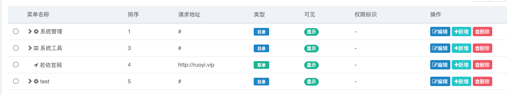

> [Suggested description]
> An issue in RUoYi v.4.8.0 allows a remote attacker to escalate
> privileges via the menuId parameter
>
> ------------------------------------------
>
> [Vulnerability Type]
> Incorrect Access Control
>
> ------------------------------------------
>
> [Vendor of Product]
> yangzongzhuan
>
> ------------------------------------------
>
> [Affected Product Code Base]
> RuoYi - v4.8.0(latest)  Fix not yet released
>
> ------------------------------------------
>
> [Affected Component]
> com.ruoyi.web.controller.system.SysMenuController.edit
>
> ------------------------------------------
>
> [Attack Type]
> Remote
>
> ------------------------------------------
>
> [Impact Escalation of Privileges]
> true
>
> ------------------------------------------
>
> [Attack Vectors]
> 1. Suppose an attacker has access to the /edit/{menuId} endpoint in the RuoYi system.
>  2. The attacker can modify the menuId parameter and send a request to update menu entries that belong to other users or system-critical menus.
>  3. Since the application does not properly enforce authorization checks, the attacker can edit menu configurations that they do not own, leading to a horizontal privilege escalation vulnerability.
>  4. This could allow unauthorized users to modify navigation menus, rename or disable important system menus, inject misleading options, or disrupt system functionality."
>
> ------------------------------------------
>
> [Reference]
> https://github.com/yangzongzhuan/RuoYi
>
> ------------------------------------------
>
> [Has vendor confirmed or acknowledged the vulnerability?]
> true
>
> ------------------------------------------
>
> [Discoverer]
> Haoran Zhao, Jinguo Yang, Lei Zhang. Secsys Lab, Fudan University

Use CVE-2025-28401.

# Vulnerability PoC

In src/main/java/com/ruoyi/web/controller/system/SysMenuController.java, at lines 121 and 122, within the edit method for /edit/{menuId}, simply modifying the menuId allows a user to edit information of other menus. The steps are as follows:
1.	The original menu is shown below. Edit the first menu item System Management, change the menu name to test and the display order to 5.

2.	Click “Edit”, intercept the request using Burp, change the menuId from 1 to 2, then forward the request.

3.	It can be observed that the second menu item System Monitoring has now become the fifth item named test.

