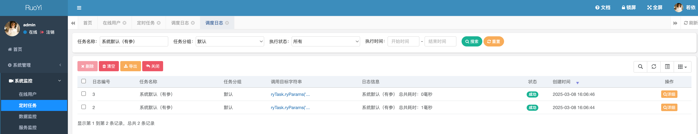

> [Suggested description]
> An issue in RUoYi v.4.8.0 allows a remote attacker to escalate
> privileges via the jobId parameter
>
> ------------------------------------------
>
> [Vulnerability Type]
> Incorrect Access Control
>
> ------------------------------------------
>
> [Vendor of Product]
> yangzongzhuan
>
> ------------------------------------------
>
> [Affected Product Code Base]
> RuoYi - v4.8.0(latest)  Fix not yet released
>
> ------------------------------------------
>
> [Affected Component]
> com.ruoyi.quartz.controller.SysJobController.detail
>
> ------------------------------------------
>
> [Attack Type]
> Remote
>
> ------------------------------------------
>
> [Impact Escalation of Privileges]
> true
>
> ------------------------------------------
>
> [Attack Vectors]
> 1. Suppose an attacker has access to the /monitor/job/detail/{jobId} endpoint in the RuoYi Quartz system.
> 2. The attacker can modify the jobId parameter in the URL and send a request to view job scheduling logs that belong to other users.
> 3. Since the application does not properly enforce authorization checks, the attacker can retrieve scheduling logs of other users without permission, leading to an unauthorized information disclosure vulnerability."
>
> ------------------------------------------
>
> [Reference]
> https://github.com/yangzongzhuan/RuoYi
>
> ------------------------------------------
>
> [Has vendor confirmed or acknowledged the vulnerability?]
> true
>
> ------------------------------------------
>
> [Discoverer]
> Haoran Zhao, Jinguo Yang, Lei Zhang. Secsys Lab, Fudan University

Use CVE-2025-28402.

# Vulnerability PoC
In lines 83 and 84 of src/main/java/com/ruoyi/quartz/controller/SysJobController.java, within the detail method for the /monitor/job/detail/{jobId} endpoint, modifying the jobId allows viewing others' scheduling logs. The process is as follows:

Execute Task 1 once and Task 2 twice.

Click the scheduling log for Task 1.

3.Use Burp to capture the packet, where you will see /monitor/job/detail/1 with jobId as 1. Modify it to 2 and click Forward.

4.You will successfully obtain the scheduling logs for Task 2, which was called twice.

