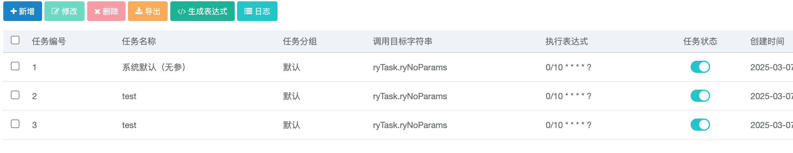
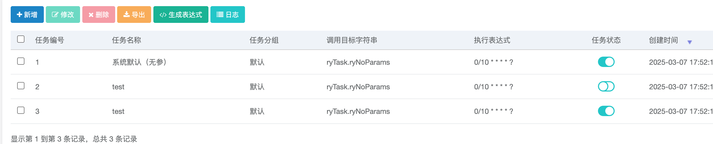

> [Suggested description]
> An issue in RUoYi v.4.8.0 allows a remote attacker to escalate
> privileges via the changeStatus method
>
> ------------------------------------------
>
> [Vulnerability Type]
> Incorrect Access Control
>
> ------------------------------------------
>
> [Vendor of Product]
> yangzongzhuan
>
> ------------------------------------------
>
> [Affected Product Code Base]
> RuoYi - v4.8.0(latest)  Fix not yet released
>
> ------------------------------------------
>
> [Affected Component]
> com.ruoyi.quartz.controller.SysJobController.changeStatus
>
> ------------------------------------------
>
> [Attack Type]
> Remote
>
> ------------------------------------------
>
> [Impact Escalation of Privileges]
> true
>
> ------------------------------------------
>
> [Attack Vectors]
> 1. Suppose an attacker is a normal user in the RuoYi system and has access to the /changeStatus/{jobId} endpoint in SysJobController.
>  2. The attacker can modify the jobId parameter and send a request to change the status of any scheduled job, even those they do not have permission to control.
>  3. Since the application does not properly enforce authorization checks, the attacker can enable, disable, or modify the execution status of other users    scheduled jobs, leading to a horizontal privilege escalation vulnerability.
>  4. This could allow unauthorized users to stop critical system tasks, enable unauthorized jobs, or disrupt system automation, causing serious operational issues."
>
> ------------------------------------------
>
> [Reference]
> https://github.com/yangzongzhuan/RuoYi
>
> ------------------------------------------
>
> [Has vendor confirmed or acknowledged the vulnerability?]
> true
>
> ------------------------------------------
>
> [Discoverer]
> Haoran Zhao, Jinguo Yang, Lei Zhang. Secsys Lab, Fudan University

Use CVE-2025-28405.

# Vulnerability PoC
In src/main/java/com/ruoyi/quartz/controller/SysJobController.java, at line 98, the changeStatus method contains both horizontal and vertical privilege escalation vulnerabilities.

Vertical privilege escalation: A regular user can directly modify the status of scheduled jobs.
As shown below, Job 1 was originally in the “Running” state:

The status was successfully changed while logged in as a regular user:

Horizontal privilege escalation: By modifying the jobId in Burp Suite, a user can change the status of other jobs.
1.	When all three jobs are in the “Running” state, click to change the status of Job 1:

2.	Intercept the request using Burp, modify the jobId to 2, then forward the request:

3.	As a result, the status of Job 2 was changed to “Stopped”:

