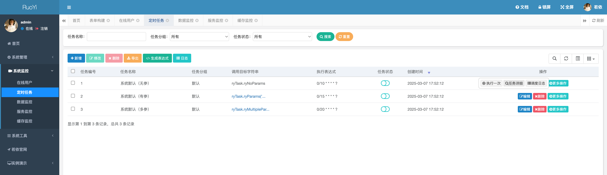
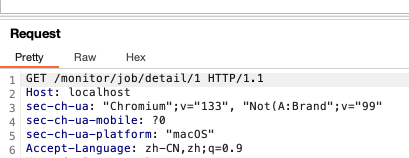
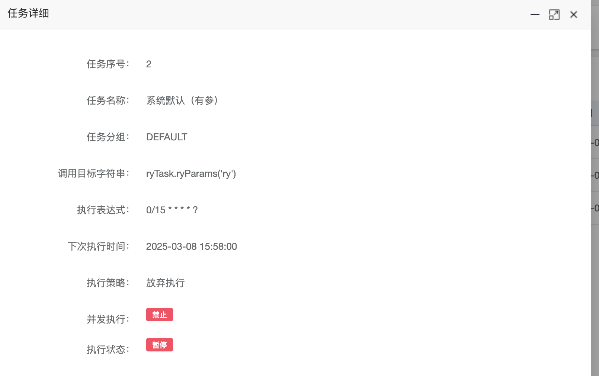

> [Suggested description]
> An issue in RUoYi v.4.8.0 allows a remote attacker to escalate
> privileges via the jobLogId parameter
>
> ------------------------------------------
>
> [Vulnerability Type]
> Incorrect Access Control
>
> ------------------------------------------
>
> [Vendor of Product]
> yangzongzhuan
>
> ------------------------------------------
>
> [Affected Product Code Base]
> RuoYi - v4.8.1(latest)  Fix not yet released
>
> ------------------------------------------
>
> [Affected Component]
> com.ruoyi.quartz.controller.SysJobLogController.detail
>
> ------------------------------------------
>
> [Attack Type]
> Remote
>
> ------------------------------------------
>
> [Impact Escalation of Privileges]
> true
>
> ------------------------------------------
>
> [Attack Vectors]
> 1. Suppose an attacker has access to the /monitor/job/detail/{jobLogId} endpoint in the RuoYi Quartz system.
>  2. The attacker can modify the jobLogId parameter in the URL and send a request to view job details that belong to other users.
>  3. Since the application does not properly enforce authorization checks, the attacker can retrieve job details of other users without permission, leading to an unauthorized information disclosure vulnerability."
>
> ------------------------------------------
>
> [Reference]
> https://github.com/yangzongzhuan/RuoYi
>
> ------------------------------------------
>
> [Has vendor confirmed or acknowledged the vulnerability?]
> true
>
> ------------------------------------------
>
> [Discoverer]
> Haoran Zhao, Jinguo Yang, Lei Zhang. Secsys Lab, Fudan University

Use CVE-2025-28406.

# Vulnerability PoC

In src/main/java/com/ruoyi/quartz/controller/SysJobLogController.java, at lines 86 and 87, within the detail method for /monitor/job/detail/{jobLogId}, modifying the jobLogId allows a user to view the details of other users’ tasks. The process is as follows:
1.	Click on the detail view of Job 1:

2.	Intercept the request using Burp. You will see the URL /monitor/job/detail/1, where jobLogId is 1. Change it to 2 and click “Forward”:

3.	The details of Job 2 are successfully displayed:

