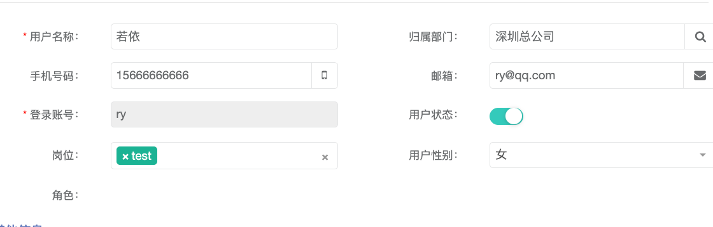
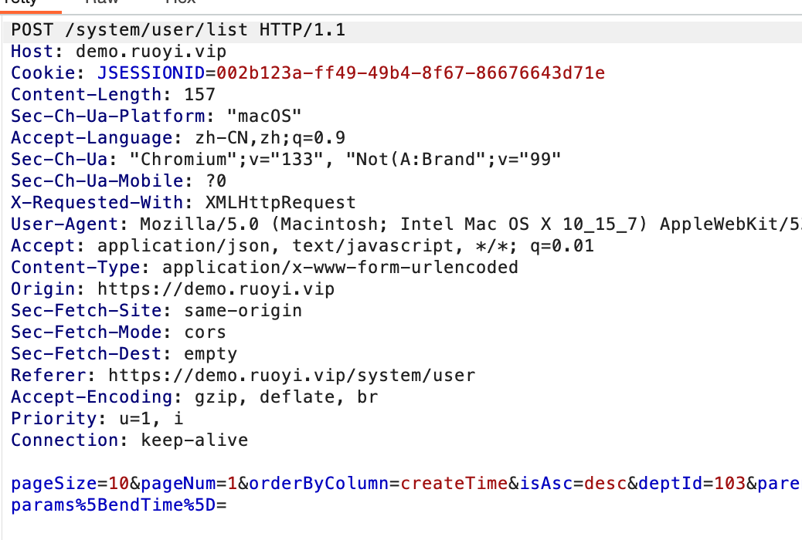
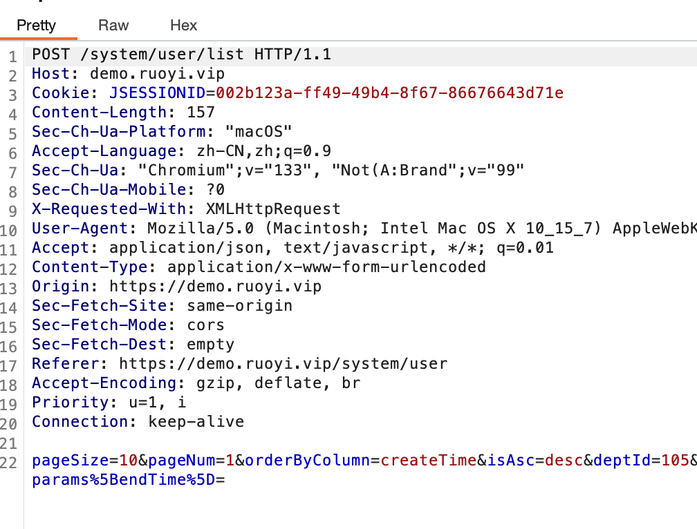

> [Suggested description]
> An issue in RUoYi v.4.8.0 allows a remote attacker to escalate
> privileges via the selectDeptTree method of the
> /selectDeptTree/{deptId} endpoint does not properly validate the deptId
> parameter
>
> ------------------------------------------
>
> [Vulnerability Type]
> Incorrect Access Control
>
> ------------------------------------------
>
> [Vendor of Product]
> yangzongzhuan
>
> ------------------------------------------
>
> [Affected Product Code Base]
> RuoYi - v4.8.0(latest)  Fix not yet released
>
> ------------------------------------------
>
> [Affected Component]
> com.ruoyi.web.controller.system.SysUserController.selectDeptTree
>
> ------------------------------------------
>
> [Attack Type]
> Remote
>
> ------------------------------------------
>
> [Impact Escalation of Privileges]
> true
>
> ------------------------------------------
>
> [Attack Vectors]
> 1. Suppose an attacker has access to the /selectDeptTree/{deptId} endpoint in the RuoYi system.
>  2. The attacker can modify the deptId parameter in the URL and send a request to view the department structure of other departments.
>  3. Since the application does not properly enforce authorization checks, the attacker can retrieve department hierarchy and details they are not authorized to access, leading to an unauthorized information disclosure vulnerability."
>
> ------------------------------------------
>
> [Reference]
> https://github.com/yangzongzhuan/RuoYi
>
> ------------------------------------------
>
> [Has vendor confirmed or acknowledged the vulnerability?]
> true
>
> ------------------------------------------
>
> [Discoverer]
> Haoran Zhao, Jinguo Yang, Lei Zhang. Secsys Lab, Fudan University

Use CVE-2025-28408.

# Vulnerability PoC

In src/main/java/com/ruoyi/web/controller/system/SysUserController.java, at lines 349 and 350, the selectDeptTree method for /selectDeptTree/{deptId} is used to select a department when editing user information. This usage is expected and works as intended, as shown below:
	1.	Click to modify the user’s affiliated department:

	2.	Intercept the request using Burp, and you’ll see the selectDeptTree endpoint:

However, when simply viewing department information, clicking on the department name allows access to other departments’ information, indicating a vertical privilege escalation vulnerability.
At the same time, by modifying the deptId using Burp Suite, users can access information of other departments, demonstrating a horizontal privilege escalation vulnerability. The process is as follows:
	1.	Click on the “R&D Department” and intercept the request with Burp. The deptId is shown as 103:

	2.	Click on the “Testing Department” and intercept the request. The deptId is 105:

	3.	Click on the “Testing Department” again, intercept the request and change the deptId to 103. The information of the “R&D Department” is displayed, confirming the existence of a horizontal privilege escalation vulnerability:

