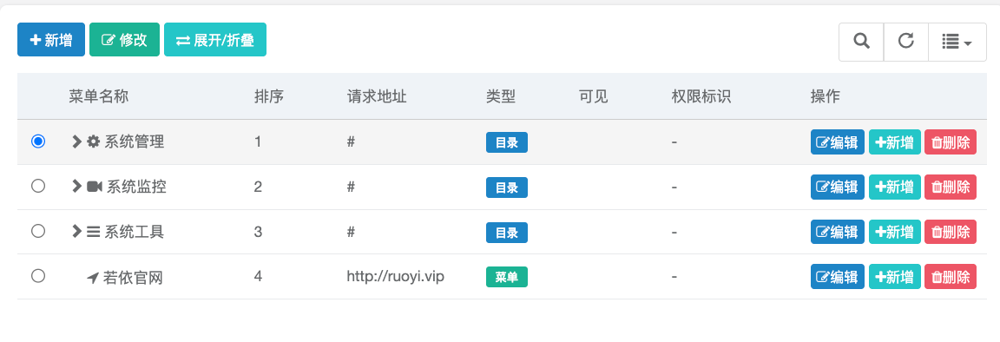
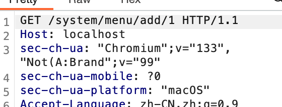

> [Suggested description]
> An issue in RUoYi v.4.8.0 allows a remote attacker to escalate
> privileges via the add method of the /add/{parentId} endpoint does not
> properly validate whether the requesting user has permission to add a
> menu item under the specified parentId
>
> ------------------------------------------
>
> [Vulnerability Type]
> Incorrect Access Control
>
> ------------------------------------------
>
> [Vendor of Product]
> yangzongzhuan
>
> ------------------------------------------
>
> [Affected Product Code Base]
> RuoYi - v4.8.0(latest)  Fix not yet released
>
> ------------------------------------------
>
> [Affected Component]
> com.ruoyi.web.controller.system.SysMenuController.add
>
> ------------------------------------------
>
> [Attack Type]
> Remote
>
> ------------------------------------------
>
> [Impact Escalation of Privileges]
> true
>
> ------------------------------------------
>
> [Attack Vectors]
> 1. Suppose an attacker has access to the /add/{parentId} endpoint in the RuoYi system.
>  2. The attacker can modify the parentId parameter and send a request to add a menu item under a different parent menu that they do not have permission to modify.
>  3. Since the application does not properly enforce authorization checks, the attacker can insert menu entries into unauthorized locations, leading to a horizontal privilege escalation vulnerability.
>  4. This could allow unauthorized users to manipulate the menu structure, potentially hiding malicious options, altering navigation flow, or confusing users with misleading entries."
>
> ------------------------------------------
>
> [Reference]
> https://github.com/yangzongzhuan/RuoYi
>
> ------------------------------------------
>
> [Has vendor confirmed or acknowledged the vulnerability?]
> true
>
> ------------------------------------------
>
> [Discoverer]
> Haoran Zhao, Jinguo Yang, Lei Zhang. Secsys Lab, Fudan University

Use CVE-2025-28409.

# Vulnerability PoC
In src/main/java/com/ruoyi/web/controller/system/SysMenuController.java at line 82, in the add method for /add/{parentId}, modifying parentId allows this method to be added under a different main directory. The process is as follows:
	1.	Click the “Add” button under System Management, use Burp to capture the request, and you’ll see that parentId is 1.

	2.	Change the parentId value from 1 to 2 and forward the request.

	3.	You’ll see that the returned menu is for adding to System Monitoring, which means it can now be added under System Monitoring.

