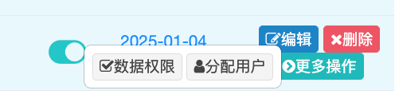
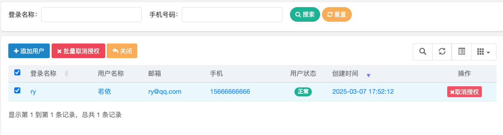
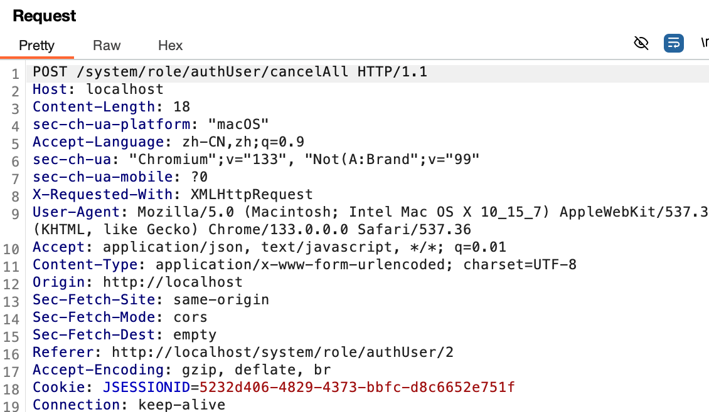

> [Suggested description]
> An issue in RUoYi v.4.8.0 allows a remote attacker to escalate
> privileges via the cancelAuthUserAll method does not properly validate
> whether the requesting user has administrative privileges
>
> ------------------------------------------
>
> [Vulnerability Type]
> Incorrect Access Control
>
> ------------------------------------------
>
> [Vendor of Product]
> yangzongzhuan
>
> ------------------------------------------
>
> [Affected Product Code Base]
> RuoYi - v4.8.0(latest)  Fix not yet released
>
> ------------------------------------------
>
> [Affected Component]
> com.ruoyi.web.controller.system.SysRoleController.cancelAuthUserAll
>
> ------------------------------------------
>
> [Attack Type]
> Remote
>
> ------------------------------------------
>
> [Impact Escalation of Privileges]
> true
>
> ------------------------------------------
>
> [Attack Vectors]
> 1.\tSuppose an attacker is a normal user in the RuoYi system and has access to the /authUser/cancelAll endpoint in SysRoleController.
> \t2.\tThe attacker can send a request to cancel all authorizations of other users, including administrators.
> \t3.\tSince the application does not enforce strict permission checks, an unauthorized user can remove critical permissions from system users, potentially locking out legitimate administrators or disrupting role-based access control (RBAC).
> \t4.\tThis could lead to privilege abuse, unauthorized access revocation, and significant security risks, as attackers can disable key accounts, escalate privileges, or cause denial-of-service (DoS) attacks against legitimate users.
>
> ------------------------------------------
>
> [Reference]
> https://github.com/yangzongzhuan/RuoYi
>
> ------------------------------------------
>
> [Has vendor confirmed or acknowledged the vulnerability?]
> true
>
> ------------------------------------------
>
> [Discoverer]
> Haoran Zhao, Jinguo Yang, Lei Zhang. Secsys Lab, Fudan University

Use CVE-2025-28410.

# Vulnerability PoC

In src/main/java/com/ruoyi/web/controller/system/SysRoleController.java at line 271, in the cancelAuthUserAll method for /authUser/cancelAll, there is a vertical privilege escalation vulnerability where ordinary users can batch revoke authorization for other users.

The process is as follows:
	1.	Click the “Assign Users” option under More Operations, and the authorized user interface will appear as shown below:

	2.	An ordinary user, test, clicks “Batch Cancel Authorization.” By capturing the request, we can see authUser/cancelAll, then forward it.

	3.	The user’s authorization is successfully canceled, exposing the vertical privilege escalation vulnerability.

