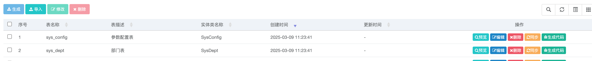
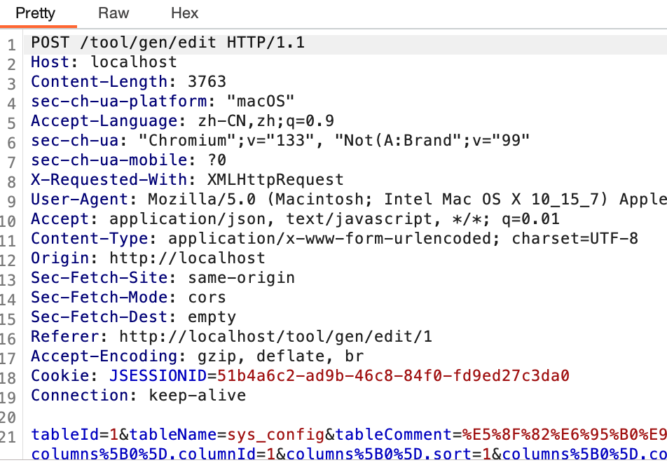

> [Suggested description]
> An issue in RUoYi v.4.8.0 allows a remote attacker to escalate
> privileges via the editSave method in /tool/gen/editSave
>
> ------------------------------------------
>
> [Vulnerability Type]
> Incorrect Access Control
>
> ------------------------------------------
>
> [Vendor of Product]
> yangzongzhuan
>
> ------------------------------------------
>
> [Affected Product Code Base]
> RuoYi - v4.8.0(latest)  Fix not yet released
>
> ------------------------------------------
>
> [Affected Component]
> com.ruoyi.generator.controller.GenController.editSave
>
> ------------------------------------------
>
> [Attack Type]
> Remote
>
> ------------------------------------------
>
> [Impact Escalation of Privileges]
> true
>
> ------------------------------------------
>
> [Attack Vectors]
> 1.\tSuppose an attacker is a normal user in the RuoYi system and has access to the /tool/gen/editSave method in GenController.
> \t2.\tThe attacker can send a crafted request to modify code generation configurations, which are typically intended for administrative users only.
> \t3.\tSince proper access control checks are missing, an unauthorized user can modify, delete, or reconfigure code generation settings, potentially altering system behavior or injecting malicious code templates.
> \t4.\tThis could lead to unauthorized business logic modifications, privilege escalation, or even backdoor creation, allowing attackers to execute arbitrary business logic within the application.
>
> ------------------------------------------
>
> [Reference]
> https://github.com/yangzongzhuan/RuoYi
>
> ------------------------------------------
>
> [Has vendor confirmed or acknowledged the vulnerability?]
> true
>
> ------------------------------------------
>
> [Discoverer]
> Haoran Zhao, Jinguo Yang, Lei Zhang. Secsys Lab, Fudan University

Use CVE-2025-28411.

# Vulnerability PoC

In src/main/java/com/ruoyi/generator/controller/GenController.java at line 174, in the editSave method for tool:gen:edit, ordinary users can modify the code generation business, leading to a vertical privilege escalation vulnerability.

The process is as follows:
	1.	Edit the sys_config. The original information is shown below. Check the first row’s config_id for editing and click “Save.”

	2.	The modification is successful, indicating the presence of a vertical privilege escalation vulnerability.

