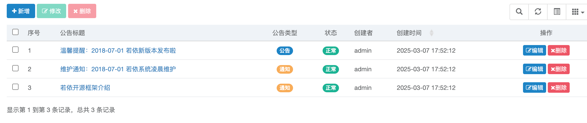
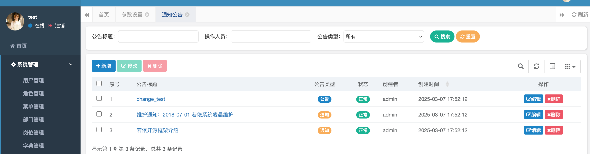

> [Suggested description]
> An issue in RUoYi v.4.8.0 allows a remote attacker to escalate
> privileges via the /editSave method in SysNoticeController
>
> ------------------------------------------
>
> [Vulnerability Type]
> Incorrect Access Control
>
> ------------------------------------------
>
> [Vendor of Product]
> yangzongzhuan
>
> ------------------------------------------
>
> [Affected Product Code Base]
> RuoYi - v4.8.0(latest)  Fix not yet released
>
> ------------------------------------------
>
> [Affected Component]
> com.ruoyi.web.controller.system.SysNoticeController.editSave
>
> ------------------------------------------
>
> [Attack Type]
> Remote
>
> ------------------------------------------
>
> [Impact Escalation of Privileges]
> true
>
> ------------------------------------------
>
> [Attack Vectors]
> 1. Suppose an attacker is a normal user in the RuoYi system and has access to the /editSave method in SysNoticeController.
>  2. The attacker can send a request to modify system-wide notifications or announcements, which should be restricted to administrators only.
>  3. Since the application does not enforce proper authorization checks, the attacker can edit or replace official announcements, potentially spreading false information, deleting important notices, or disrupting communication within the system.
>  4. This could lead to misinformation, security policy violations, and unauthorized system modifications, causing serious security and operational risks."
>
> ------------------------------------------
>
> [Reference]
> https://github.com/yangzongzhuan/RuoYi
>
> ------------------------------------------
>
> [Has vendor confirmed or acknowledged the vulnerability?]
> true
>
> ------------------------------------------
>
> [Discoverer]
> Haoran Zhao, Jinguo Yang, Lei Zhang. Secsys Lab, Fudan University

Use CVE-2025-28412.

# Vulnerability PoC

Vertical Privilege Escalation Vulnerability:
In src/main/java/com/ruoyi/web/controller/system/SysNoticeController.java at line 97, in the editSave method, ordinary users can directly modify the notice announcement, indicating the presence of a vertical privilege escalation vulnerability.

The original announcement is as follows:

The modification was successfully made, as shown below:

