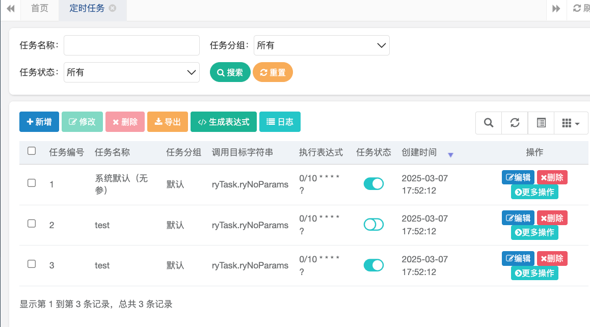
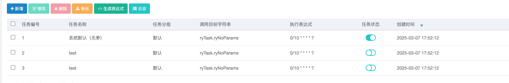

# Case1 con:6  有漏洞
水平越权漏洞：
在src/main/java/com/ruoyi/quartz/controller/SysJobLogController.java的86，87行，/monitor/job/detail/{jobLogId}的detail方法中
通过修改jobLogId可以查看别人的任务详细，流程如下：

1.点击任务一的任务详细

2.用burp抓包，可以看到/monitor/job/detail/1，jobLogId为1，修改为2
点击forward

3.成功看到任务2的任务详细

# Case2 con:11 有漏洞
水平越权漏洞：
在src/main/java/com/ruoyi/quartz/controller/SysJobController.java的83，84行，/monitor/job/detail/{jobId}的detail方法中
通过修改jobId可以查看别人的调度日志，流程如下：
1.执行任务1一次，执行任务2两次

2.点击任务一的调度日志

3.用burp抓包，可以看到/monitor/job/detail/1，jobId为1，修改为2
点击forward

4.可以看到成功获得了调用了两次的任务2的调度日志

# Case3 con:18 不确定
在src/main/java/com/ruoyi/web/controller/system/SysDictTypeController.java的48行，system:dict:list的list方法中，
在获取字典列表时会调用，burp拦截的请求如图：

forward之后会在页面展示dict列表

如果字典信息比较敏感的话会是垂直越权漏洞

# Case4 con:28 不确定
在src/main/java/com/ruoyi/generator/controller/GenController.java的97行，tool:gen:list的columnList方法中，
在获取代码生成列表时会调用，burp拦截的请求如图：

forward之后会在页面展示代码生成列表

如果代码生成列表信息比较敏感的话会是垂直越权漏洞

# Case5 con:30  有漏洞
水平越权漏洞：
在src/main/java/com/ruoyi/quartz/controller/SysJobController.java的169,170行，/monitor/job/edit/{jobId}的edit方法中
通过修改jobId可以更改别的任务的信息，流程如下：
1.点击编辑任务一，把名字改为test

2.用burp抓包，点击更改，forward第一个之后，在第二个包发现jobid关键字，把它改为2，并forward

3.发现任务二的名字变为了test

# Case6 con:34  有漏洞
在src/main/java/com/ruoyi/web/controller/system/SysUserController.java的349，350行，/selectDeptTree/{deptId}的selectDeptTree方法中，selectDeptTree用于编辑用户信息时选择部门，这应该是没问题的，如图
1.点击修改归宿部门：

2.burp抓包可以发现selectDeptTree

但是查看信息时，点击部门名称就可以获取其他部门的信息，存在垂直越权漏洞
同时，用burp修改deptId就可以获取其他部门的信息，有水平越权漏洞，流程如下：
1.点击研发部门，用burp抓包，可以看到deptId为103

2.点击测试部门，用burp抓包，可以看到deptId为105

3.点击测试部门，用burp抓包，修改deptId为103，可以看到研发部门信息，说明存在水平越权漏洞

# Case7 con:38 有漏洞
垂直越权漏洞：字典存储用户信息，可以直接更改字典信息说明存在垂直越权
水平越权漏洞：
在src/main/java/com/ruoyi/web/controller/system/SysDictTypeController.java的98，99行，/edit/{dictId}的edit方法中，仅更改
dictId就可以编辑其他字典，流程如下：
1.编辑用户性别字典，修改字典名称，类型和备注为test

2.点击修改，用burp抓包，把dictId改为2，之后forward

3.可以发现用户性别字典下面的第二个字典被全部修改

# Case8 con:40 有漏洞
在src/main/java/com/ruoyi/web/controller/system/SysMenuController.java的82行，/add/{parentId}的add方法中，修改parentId就可以把该方法加入别的主目录中，流程如下：
1.点击系统管理的新增按钮,用burp抓包，可以发现parentId为1

2.修改parentId的1为2，forward
3.可以发现返回了系统监控的添加菜单，可以加入到系统监控里面

# Case9 con:50 有漏洞
垂直越权漏洞：可以直接更改菜单信息说明存在垂直越权
水平越权漏洞：
在src/main/java/com/ruoyi/web/controller/system/SysMenuController.java的121，122行，/edit/{menuId}的edit方法中，仅修改menuId就可以修改别的菜单的信息，流程如下：
1.原先菜单如下：，编辑第一个菜单系统管理，修改菜单名称为test，显示顺序为5

2.点击修改，用burp抓包，把menuId从1改为2，之后forward

3.可以发现第二的系统监控变成了第五的test

# Case10 con:53 不确定
在src/main/java/com/ruoyi/quartz/controller/SysJobLogController.java的58行，monitor:job:list的list方法中
在获取job列表时会调用，burp拦截的请求如图：

forward之后会在页面展示job列表

如果job信息比较敏感的话会是垂直越权漏洞

# Case11 con:54 有漏洞
垂直越权漏洞：可以直接更改岗位信息说明存在垂直越权
水平越权漏洞：
在src/main/java/com/ruoyi/web/controller/system/SysPostController.java的109，110行，/edit/{postId}的edit方法中，仅修改postId就可以修改别的岗位的信息，流程如下：
1.原先岗位信息如下，编辑第一个岗位董事长，

2.点击修改并抓包，把postId改为2，forward

3.可以发现2号岗位移到了最后，变成了test

# Case12 con:58 有漏洞
垂直越权漏洞：
在src/main/java/com/ruoyi/web/controller/system/SysConfigController.java的113行，editSave方法中，普通用户可以直接更改config信息说明存在垂直越权
原本config如下：

如图成功修改：

# Case13 con:64 有漏洞
在src/main/java/com/ruoyi/quartz/controller/SysJobController.java的98行，changeStatus方法存在水平越权和垂直越权漏洞
垂直越权漏洞：普通用户可以直接修改任务状态:
如图任务1原本为运行状态：

以普通用户身份改变状态成功：

水平越权漏洞：在burp修改jobid就可以修改别的任务的状态：
1.三个任务都为运行时，点击修改任务1的任务状态

2.用burp抓包，修改jobid为2，forward

3.可以发现任务2状态改变为关闭状态：

# Case14 con:65 有漏洞
在src/main/java/com/ruoyi/quartz/controller/SysJobController.java的98行，changeStatus方法存在水平越权和垂直越权漏洞
垂直越权漏洞：普通用户可以直接修改任务状态:
如图任务1原本为关闭状态：

以普通用户身份改变状态成功：

水平越权漏洞：在burp修改jobid就可以修改别的任务的状态：
1.三个任务都为关闭时，点击修改任务1的任务状态

2.用burp抓包，修改jobid为2，forward

3.可以发现任务2状态改变为运行状态：

# Case15 con:71 有漏洞
垂直越权漏洞：
在src/main/java/com/ruoyi/web/controller/system/SysNoticeController.java的97行，editSave方法中，普通用户可以直接修改通知公告，说明存在垂直越权漏洞
原本公告如下：

如图成功修改：

# Case16 con:138 有漏洞
在src/main/java/com/ruoyi/web/controller/system/SysRoleController.java的271行，/authUser/cancelAll的cancelAuthUserAll方法中，普通用户可以批量取消授权用户的授权存在垂直越权漏洞
流程如下：
1.点击更多操作的分配用户选项，可以看到授权用户界面如图：

2.用普通用户test点击批量取消授权，抓包可以发现authUser/cancelAll，forward

3.成功取消用户授权，存在垂直越权漏洞

# Case17 con:144 有漏洞
垂直越权漏洞：在src/main/java/com/ruoyi/web/controller/system/SysDictTypeController.java的112行，editSave方法中，用户可以更改字典信息，字典存储用户信息，可以直接更改字典信息说明存在垂直越权
字典信息原本如下：

修改成功：

# Case18 con:144 有漏洞
在src/main/java/com/ruoyi/generator/controller/GenController.java的174行，tool:gen:edit的editSave方法中，普通用户就可以修改代码生成业务，存在垂直越权漏洞
流程如下：
1.对sys_config进行编辑，原本信息如图，勾选第一行config_id的编辑，点击保存

2.成功修改，说明存在垂直越权漏洞

